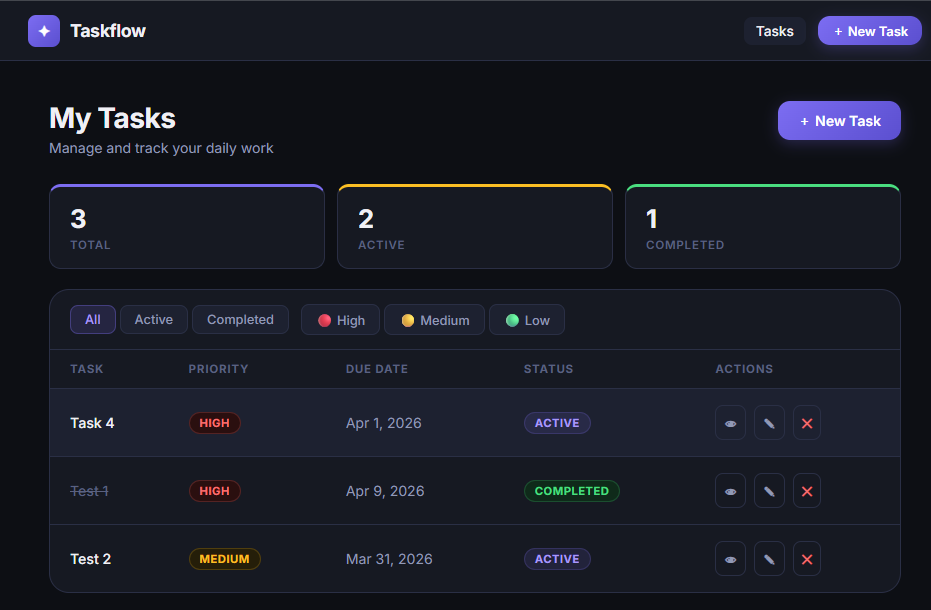
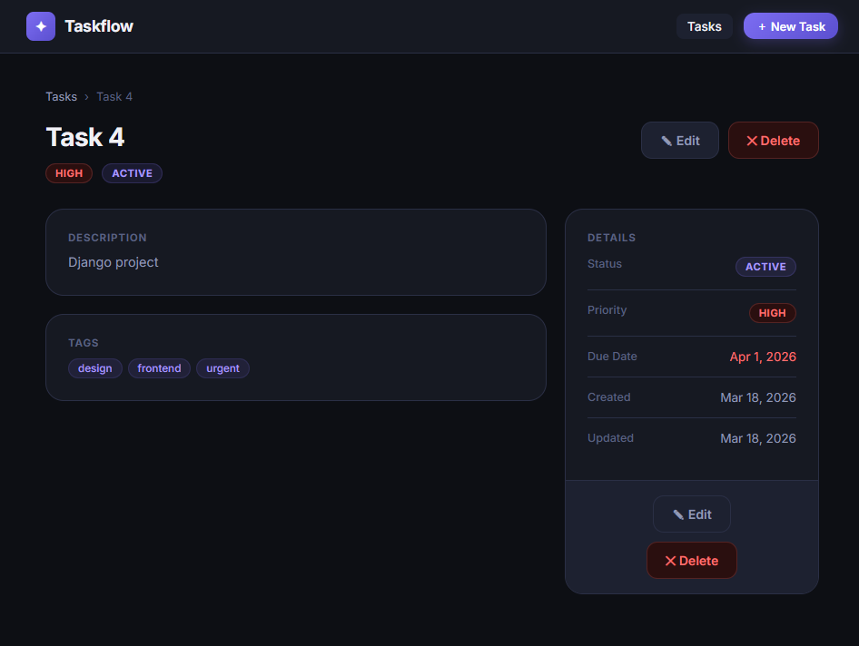
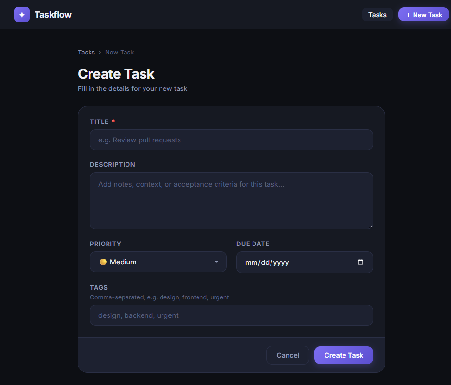
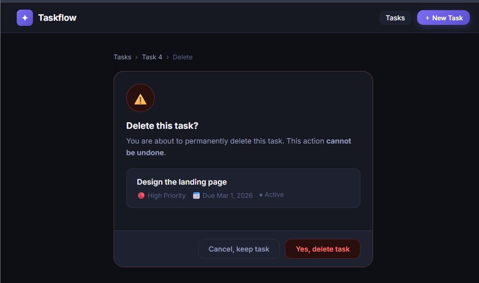

# 📝 TaskFlow - Django Todo App

A clean and modern **Todo Task Management Web Application** built with **Django**.

This project allows users to create, manage, update, and track tasks with priority, status, and due dates.

---

## 🚀 Features

- ✅ **Create** new tasks
- ✅ **Edit** existing tasks
- ✅ **Delete** tasks
- ✅ Mark task as **Completed**
- ✅ Filter by **Status** (All / Active / Completed)
- ✅ Filter by **Priority** (High / Medium / Low)
- ✅ Dynamic statistics dashboard
- ✅ Tag system (comma-separated tags)
- ✅ Clean & modern UI
- ✅ Responsive design

---

## 🛠️ Tech Stack

- **Python 3**
- **Django**
- **HTML5**
- **CSS3**
- **SQLite3**
- **Git & GitHub**

---

## 📸 Screenshots

---

### 🏠 Home Page

<p align="center">
  
</p>

---

### 📄 Task Detail Page

<p align="center">
  
</p>

---

### ➕ Create Task Page

<p align="center">
  
</p>

---

### ❌ Delete Task Page

<p align="center">
  
</p>

---

## ⚙️ Installation Guide

Follow these steps to run the project locally:

### 1️⃣ Clone the repository

```bash
git clone https://github.com/utsho261/todo-django.git
```

### 2️⃣ Navigate into the project folder

```bash
cd todo-django
```

### 3️⃣ Create a virtual environment

```bash
python -m venv venv
```

Activate it:

**Windows:**
```bash
venv\Scripts\activate
```

**Mac/Linux:**
```bash
source venv/bin/activate
```

### 4️⃣ Install dependencies

```bash
pip install django
```

### 5️⃣ Run migrations

```bash
python manage.py migrate
```

### 6️⃣ Run the development server

```bash
python manage.py runserver
```

Open your browser and go to:

```
http://127.0.0.1:8000/
```

---

## 📂 Project Structure

```
todo-django/
│
├── core/          # Main Django app
├── templates/     # HTML templates
├── static/        # CSS & static files
├── manage.py
└── db.sqlite3
```

---

## ✅ Future Improvements

- 🔐 User authentication system
- 🔎 Search functionality
- 📄 Pagination
- 🌐 REST API version
- 🚀 Cloud deployment

---

## 👨‍💻 Author

Developed by **Utsho Roy**  
GitHub: https://github.com/utsho261

---

## ⭐ Support

If you like this project, please consider giving it a ⭐ on GitHub!